# System Architecture — CA-masters Pipeline

> Paste into [mermaid.live](https://mermaid.live) to render, then export as PNG/PDF for the thesis.

```mermaid
flowchart TB

  %% ============================================================
  %% DEVELOPER WORKSTATION
  %% ============================================================
  subgraph DEV["🖥️  Developer Workstation"]
    direction TB
    REPO["GitHub Repository<br/><b>JakubGryc31/CA-masters</b><br/>── src/ (CA, control, dynamics, experiments, analysis)<br/>── scripts/ (sweep, QC, upload)<br/>── dashboard/ (streamlit_app.py)<br/>── dockerfile<br/>── requirements.txt"]
    DOCKER_BUILD["<b>docker build</b><br/>FROM python:3.11-slim<br/>COPY src, scripts<br/>pip install -r requirements.txt"]
    DOCKER_PUSH["<b>docker push</b><br/>→ Azure Container Registry"]

    REPO --> DOCKER_BUILD --> DOCKER_PUSH
  end

  %% ============================================================
  %% AZURE PLATFORM
  %% ============================================================
  subgraph AZURE["☁️  Azure Platform"]
    direction TB

    %% --- Container Registry ---
    subgraph ACR["Azure Container Registry"]
      IMAGE["<b>ca-masters:latest</b><br/>Python 3.11 + numpy, scipy,<br/>pandas, matplotlib, pyyaml,<br/>azure-storage-blob, streamlit,<br/>plotly, tabulate"]
    end

    %% --- Container Apps Job ---
    subgraph CAJOB["Azure Container Apps Job"]
      direction TB
      JOB_TRIGGER["<b>Job trigger</b><br/>Manual or scheduled<br/>Args: --T 600 --outdir outputs/thesis_artifacts --seeds 25"]

      subgraph ORCHESTRATOR["run_sweep_and_upload.py  (orchestrator)"]
        direction TB

        subgraph STAGE1["Stage 1 — Parameter Sweep"]
          direction TB
          SWEEP_SCRIPT["<b>run_thesis_sweep.py</b>"]
          FACTORIAL["Full factorial design:<br/>3 controllers × 2 grids × 2 turbulence × 3 failures<br/>= <b>36 groups × 25 seeds = 900 episodes</b>"]
          SIM_LOOP["Per episode (T = 600 steps):<br/>CAState → PID controller → FirstOrderActuator<br/>→ Turbulence (OU process) → step_ca()<br/>→ crash_condition() → log metrics"]
          SWEEP_SCRIPT --- FACTORIAL --- SIM_LOOP
        end

        subgraph STAGE2["Stage 2 — Quality Control"]
          direction TB
          QC_SCRIPT["<b>qc_after_sweep.py</b>"]
          QC_CHECKS["✓ All 36 groups have ≥ 15 seeds<br/>✓ Recompute grouped stats<br/>  (recovery_rate, ttr_conditional_mean)<br/>✓ Write qc_report.json + qc_report.md"]
          QC_GATE{{"Pass?"}}
          QC_FAIL["❌ Abort upload<br/>exit code ≠ 0"]
          QC_SCRIPT --- QC_CHECKS --> QC_GATE
          QC_GATE -->|No| QC_FAIL
        end

        subgraph STAGE3["Stage 3 — Upload to Blob Storage"]
          direction TB
          AUTH_CHECK{"USE_MI=1?"}
          MI_AUTH["Managed Identity<br/>(DefaultAzureCredential)"]
          SAS_AUTH["SAS token<br/>(AZ_BLOB_SAS)"]
          UPLOAD_FILES["Upload all files under<br/>outputs/thesis_artifacts/<br/>to timestamped folder"]
          UPDATE_LATEST["Overwrite <b>latest.txt</b><br/>with new timestamp"]
          AUTH_CHECK -->|Yes| MI_AUTH --> UPLOAD_FILES
          AUTH_CHECK -->|No| SAS_AUTH --> UPLOAD_FILES
          UPLOAD_FILES --> UPDATE_LATEST
        end

        STAGE1 --> STAGE2
        QC_GATE -->|Yes| STAGE3
      end

      JOB_TRIGGER --> ORCHESTRATOR
    end

    %% --- Blob Storage ---
    subgraph BLOB["Azure Blob Storage  (container: output-simulation)"]
      direction TB
      LATEST["<b>latest.txt</b><br/>e.g. '20251122-2019'"]

      subgraph RUNFOLDER["📁 20251122-2019/"]
        direction TB
        RAW_CSV["<b>metrics_summary_raw.csv</b><br/>900 rows — one per episode<br/>Cols: controller, grid, turbulence,<br/>failure, seed, overshoot,<br/>time_to_recover, crash, control_effort"]
        GROUPED_CSV["<b>metrics_summary_grouped.csv</b><br/>36 rows — one per group<br/>Cols: …_mean, …_std,<br/>recovery_count, recovery_rate,<br/>ttr_conditional_mean"]
        TS_SAMPLES["<b>timeseries_samples/</b><br/>Per-episode CSV traces<br/>(t, error, u)"]
        QC_ARTIFACTS["<b>qc_report.json</b><br/><b>qc_report.md</b>"]
      end
    end

    %% --- Dashboard ---
    subgraph DASHBOARD["Streamlit Dashboard  (streamlit_app.py)"]
      direction TB
      READ_LATEST["1. Read <b>latest.txt</b><br/>→ resolve run folder"]
      LOAD_CSV["2. Fetch <b>grouped</b> + <b>raw</b> CSVs<br/>via BlobServiceClient<br/>(SAS or Managed Identity)"]
      FILTERS["3. Sidebar filters:<br/>Controller · Grid · Turbulence · Failure"]
      CHARTS["4. Render charts:<br/>• KPI metrics row (overshoot, TTR, crash, effort)<br/>• Recovery rate + conditional TTR<br/>• Bar charts with ±1 std error bars<br/>• Pareto scatter (overshoot vs. effort)<br/>  faceted by turbulence × failure<br/>• PNG + CSV download buttons"]

      READ_LATEST --> LOAD_CSV --> FILTERS --> CHARTS
    end
  end

  %% ============================================================
  %% CONSUMERS
  %% ============================================================
  subgraph USERS["👥  Consumers"]
    direction LR
    STUDENT["Student<br/>(Jakub)"]
    PROMOTOR["Promotor /<br/>Committee"]
    STAKEHOLDERS["Other<br/>Researchers"]
  end

  %% ============================================================
  %% CONNECTIONS
  %% ============================================================
  DOCKER_PUSH ==>|"push image"| IMAGE
  IMAGE ==>|"pull & run"| JOB_TRIGGER

  UPDATE_LATEST -->|"writes pointer"| LATEST
  UPLOAD_FILES -->|"writes CSVs, QC reports,<br/>timeseries samples"| RUNFOLDER

  LATEST -.->|"resolves folder"| READ_LATEST
  RUNFOLDER -.->|"HTTP (SAS / MI)"| LOAD_CSV

  CHARTS ==>|"interactive web UI<br/>+ downloadable PNG/CSV"| STUDENT
  CHARTS ==>|"interactive web UI<br/>+ downloadable PNG/CSV"| PROMOTOR
  CHARTS ==>|"interactive web UI<br/>+ downloadable PNG/CSV"| STAKEHOLDERS

  %% ============================================================
  %% STYLING
  %% ============================================================
  classDef devStyle fill:#e8f0fe,stroke:#4285f4,stroke-width:2px
  classDef azureStyle fill:#e6f3ff,stroke:#0078d4,stroke-width:2px
  classDef blobStyle fill:#fff3e0,stroke:#ff8f00,stroke-width:2px
  classDef dashStyle fill:#e8f5e9,stroke:#2e7d32,stroke-width:2px
  classDef userStyle fill:#fce4ec,stroke:#c62828,stroke-width:2px
  classDef stageStyle fill:#f3e5f5,stroke:#7b1fa2,stroke-width:1px

  class DEV devStyle
  class AZURE azureStyle
  class BLOB blobStyle
  class DASHBOARD dashStyle
  class USERS userStyle
  class STAGE1,STAGE2,STAGE3 stageStyle
```

## Key differences from previous (outdated) diagram

| Removed (was wrong) | Added (matches codebase) |
|---|---|
| GitHub Actions CI/CD pipeline | Manual docker build/push from workstation |
| Power BI Service as dashboard | Streamlit only (streamlit_app.py) |
| "Trigger Power BI Refresh" step | — |
| Generic "writes CSV/PNG" label | Detailed 3-stage orchestrator (sweep → QC → upload) |
| — | QC gate that blocks upload on failure |
| — | latest.txt pointer mechanism shown explicitly |
| — | Full artifact schema (raw CSV, grouped CSV, timeseries, QC reports) |
| — | Auth branching (SAS token vs. Managed Identity) |
| — | Factorial design details (36 groups × 25 seeds) |
| — | Dashboard data flow (resolve pointer → load CSVs → filter → render) |